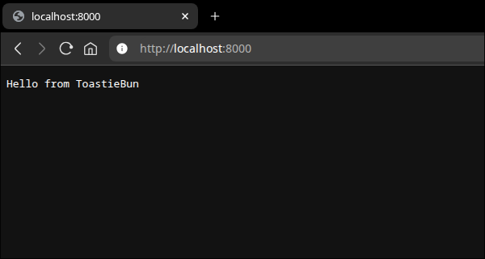

# ToastieBun

[](https://github.com/IsCoffeeTho/toastiebun/actions/workflows/test-bun.yml)

[**`git`**](https://github.com/IsCoffeeTho/toastiebun) | [**`npm`**](https://www.npmjs.com/package/toastiebun) | [**`wiki`**](https://github.com/IsCoffeeTho/toastiebun/wiki)

ToastieBun is an express like bun based http server framework.


## Installation
```bash
bun install toastiebun
```
### Usage
```ts
// index.ts

import toastiebun from "toastiebun";

const app = new toastiebun.server();

app.get("/", (req, res) => {
	res.send("Hello from Toastiebun");
})

app.listen("127.0.0.1", 8000);
```


## Development
```bash
# Unit Tests
bun test

# Mock Server @ http://localhost:3000
bun start :: 3000
```