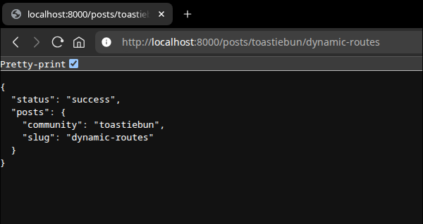

# Dynamic Routes

## Introduction

Often when making a website there will be a need to have content available after the fact of writing the code. You could just continuously add `.get` handlers to accommodate but this doesn't handle the case where things get deleted.

Let's write an example about handling requests where you could have a variable name in the path and how to access the variable.
## Example

Suppose you want to write a blog and want to separate out the various 

```ts
import toastiebun from "toastiebun";

const app = new toastiebun.server();

app.get("/posts/:community/:slug", (req, res) => {
	res.send({
		status: "success",
		posts: {
			community: req.params.community,
			slug: req.params.slug,
		}
	})
});

app.listen("::", 8000, () => {
	console.log("Server running at http://localhost:8000");
});
```



This is great for simple pages that are stored somewhere else and can be accessed by the server however, dynamic routes can also be used to write APIs with a bit more complex structuring.